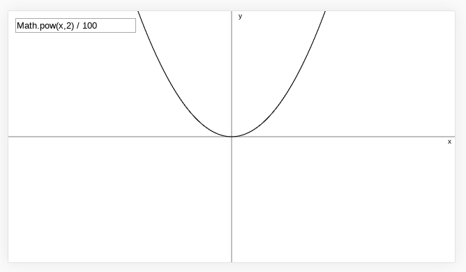

# plot

Plot equations using JavaScript canvas



[Live version](https://victorribeiro.com/plot)

## About

I've made this a while ago cause I was struggling with a math class and feeling really dumb, so I made this to make myself feel better. Few lines of code and I was able to plot any equation.

## How to use it

You can mix two equations by assigning them to variables:

```javascript
a = 0.2*x+100; b = x ** 2 * 0.1; Math.min(a,b);
```

## ToDo

I'm proprably never coming back to this project, since there's so many other great tools out there for this very purpose, but if anyone wants to exercise their programming skills, here's what you can add to this project:
* Pan mode  
* Zoom
* Plot more than one equation (different colors)
* Export the graph  
